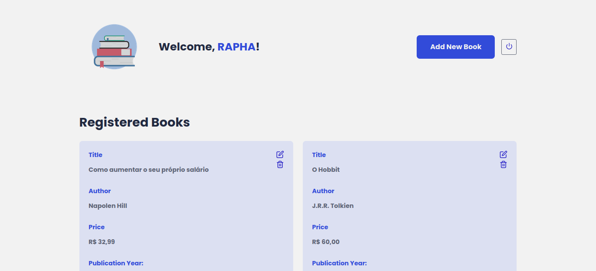
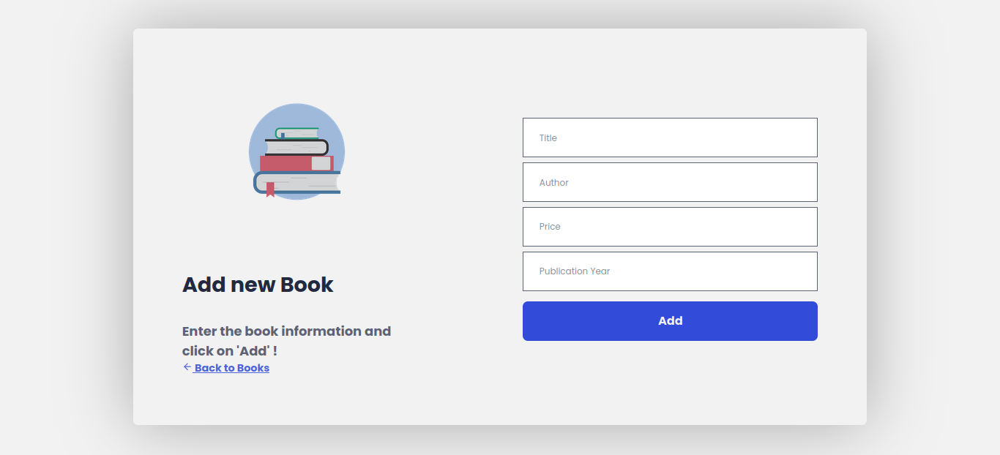

# Projeto Final - #TransformaTec

Esse projeto foi desenvolvido colocando em prática os conhecimentos adquiridos ao longo do programa TransformaTec da <b>Digital Innovation One</b>.
O objetivo do projeto foi criar uma loja online de livros usados, como um sebo,  utilizando as tecnologias de <b>HTML</b>, <b>CSS</b> e <b>React</b> para criar toda parte visual do *FrontEnd*. No <i>BackEnd<i/> foi criada uma API com <b>Java - Spring Boot</b>. Uma interface simples e intuitiva que também conta com login e permissões de usuários.

### Screenshot

### Linguagens utilizadas

- HTML
- CSS
- React
- Java
- Spring Boot

## Autor

- Github - [fagundesraphael](https://github.com/fagundesraphael)
- Linkedin - [fagundesraphael](https://www.linkedin.com/in/fagundesraphael)
- Frontend Mentor - [@fagundesraphael](https://www.frontendmentor.io/profile/fagundesraphael)
